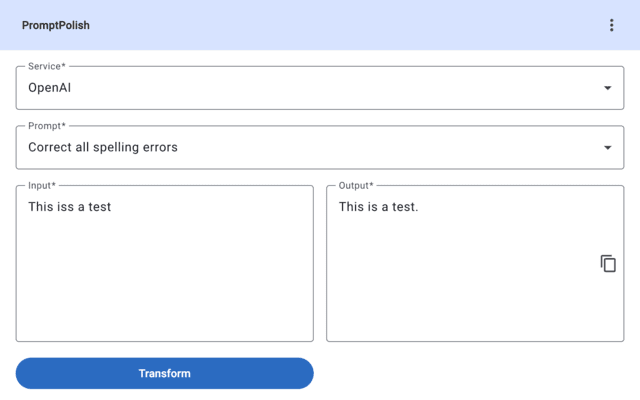

# PromptPolish

PromptPolish is a chrome extension, allowing you to copy content, polish it up with a prompt and an AI model, and paste it back to in the website.

## Installation

### Web Store

You can install the extension from the [Chrome Web Store](https://chromewebstore.google.com/detail/promptpolish/alahndbompemffbdajgeelhhdoagcglh). Since this extension is new to the store, you will get a warning during the installation when Safe Browsing is enabled.

> For new developers, it will take at least a few months of respecting these conditions to become trusted

[Google Blog](https://blog.google/intl/en-in/company-news/technology/new-protections-enhanced-safe-browsing-users-chrome/)

All functions are also available when you build the extension yourself and add it to your browser.

### Manual installation

You can get the latest version of the extension from the [releases page](https://github.com/cre8/prompt-polish/releases).

- Download the latest `Chrome Extension` file and extract it.
- Open Chrome and go to `chrome://extensions/`
- Enable developer mode
- Click on `Load unpacked`
- Select the `prompt-polish` folder in the extracted folder.
- The extension should now be installed.
- Click on the extension icon in the top right corner of the browser to configure it.

The extension can be used in other chromium based browsers as well like Brave, Edge, etc.

## Configuration

Before using the extension, you need to configure at least one AI service and a prompt.

## Security

Prompt information and access tokens are stored in the browser storage and will not be shared with any third party. No data is sent to any server except the AI service you configured. In production mode, the `chrome.storage` will be used to store the data. In development mode, the data will be stored in the browser's local storage.

## Supported AI Services

Before using the extension, you need configure at least of the the supported AI services. More AI Services can be added to this project by anyone. In case you want to add a new AI service, look [here](./docs/add-ai-services.md) for more information.

The usage of ChatGPT for this tool is not possible since there is no API available for it.

### OpenAI

- Create an account on [OpenAI](https://platform.openai.com/signup) and create an API key.
- Also get the project ID from the OpenAI dashboard.
- Configure the model you want to use.

Granular configuration is not yet supported, but will be added in the future.

### Anthropic

This service was not tested yet, contribution is welcome.

- Create an account on [Anthropic](https://www.anthropic.com/) and create an API key.

## Development

The extension is built using Angular. To run the extension locally, follow the steps below:

- Clone the repository
- Run `pnpm install`
- Run `pnpm run watch`
- Open Chrome and go to `chrome://extensions/`
- Enable developer mode
- Click on `Load unpacked`
- Select the `dist/prompt-polish/browser/` folder in the repository.

When you update the files in the `public` folder, you need to restart it manually since this folder is not watched by the Angular CLI. After an update of the code, normally closing and opening the extension should be enough. When doing changes on the manifest file, you need to refresh it in the extensions page.
